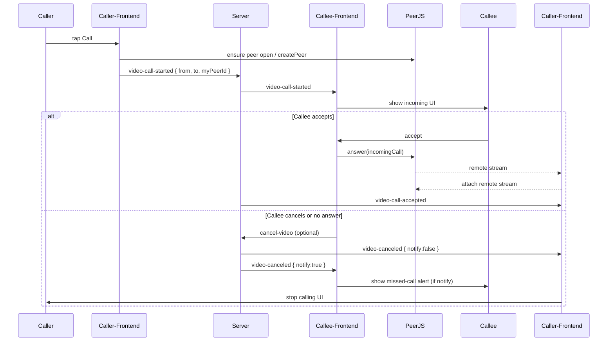
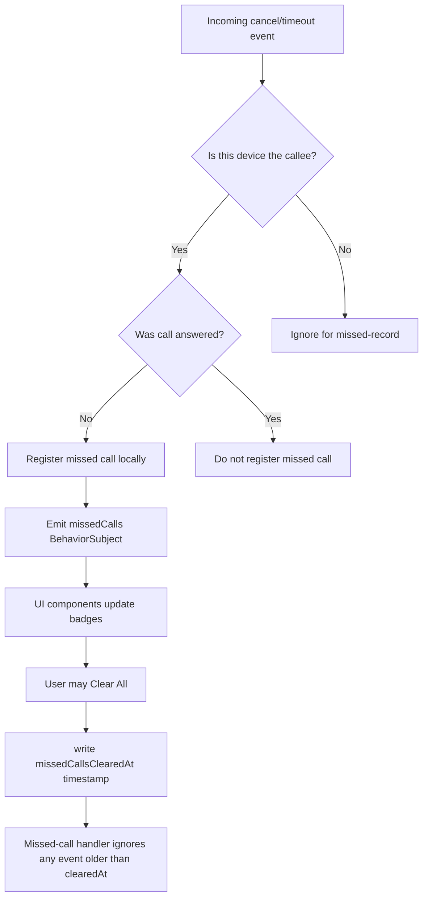

Overview

This document describes the Onprimse (Loopa-derived) mobile/web messaging and video-call application at a business level. It explains how the product works end-to-end, the responsibilities of frontend and backend systems, key user flows, realtime signaling, missed-call handling, and operational notes.

Audience and purpose

This README is written for business stakeholders, product managers, and technical leads who need a clear, non-code-heavy explanation of how the app behaves and how its pieces interact. It covers customer-facing behavior, backend guarantees, and integration points.

High-level product summary

- Real-time chat: users can send text, images, and product references in private threads. Messages appear in near-real-time across devices.
- Voice & video calls: 1:1 video calling using Peer-to-Peer WebRTC (PeerJS) with server-assisted signaling via Socket.IO.
- Missed-call experience: when a call is canceled or goes unanswered, the callee gets a "missed call" record. Badges show missed-call counts in real time. Clearing missed calls is immediate and robust against delayed signals.
- Native features: the app supports mobile native integrations (camera, file, notifications) with Cordova/Capacitor plugins plus browser fallbacks.

Frontend responsibilities (what the app does for the user)

1) Authentication & identity
- Users authenticate with JWT tokens. The frontend decodes the token and uses the user id for all operations.
- The client stores identity/token in secure storage (NativeStorage on device, localStorage on web).

2) Chat UI and threads
- The `messages` screens show a list of conversation threads ordered by latest activity.
- Each thread row shows the latest message, a per-thread "New" flag, and a compact missed-call badge when applicable.
- Opening a thread loads messages and marks the thread as read (updates local last-read map and notifies server).

3) Realtime messaging and presence
- A persistent Socket.IO connection is established after login. Messages and presence events are emitted/received through it.
- New message events update the UI instantly and move threads to the top.

4) Video/Voice calling UX
- Calls are initiated from the chat thread screen. The caller requests local media and initiates a PeerJS call.
- The app uses a small cooldown to prevent re-calling too quickly.
- Incoming calls navigate to a dedicated `video` screen where the callee can accept or decline.
- If answered, the app attaches local and remote media streams and starts a call timer.

5) Missed-call handling and badges
- A centralized missed-call stream is maintained in frontend memory (BehaviorSubject) and persisted in localStorage.
- Missed calls are recorded only for the callee side. The server helps by emitting canonical `video-canceled`/`timeout` events with a `notify` flag; the callee uses that to decide whether to record a missed call.
- UI components subscribe to the central stream and show per-user and global missed-call badges in real-time.
- Clearing missed calls sets a `missedCallsClearedAt` timestamp so delayed signals older than the clear time are ignored.

Backend responsibilities (what the server guarantees)

1) Authentication APIs
- Issues JWT tokens; verifies user identity on protected API endpoints.

2) Message persistence and delivery
- Stores messages, supports pagination, and emits `new-message` events on Socket.IO to relevant recipients.

3) Signaling & call orchestration
- Provides a Socket.IO-based signaling channel to relay `video-call-started`, `video-canceled`, `cancel-video`, `video-call-timeout`, and `video-call-accepted` events between caller and callee.
- Ensures canonical payload shapes: { from, to, myPeerId?, partnerPeerId?, at, reason, notify }.
- Emits `video-canceled` to both caller and callee with `notify: true` for callee and `notify: false` for caller (caller doesn't record missed call).

4) Peer registry (optional)
- PeerJS peer IDs (if server-managed) are stored so the server can help find a user's active PeerJS id for direct P2P dialing.

Realtime flow for a 1:1 video call (business flow)

1) Caller initiates call
- Caller requests camera/mic and locally shows "calling" UI.
- Frontend ensures a PeerJS peer is created (or waits for it), resolves callee's current peer-id via the backend, then calls using PeerJS.
- The frontend emits a `video-call-started` signal to the server with caller/callee/peer ids.

2) Callee incoming call
- Server notifies callee via Socket.IO using `video-call-started` (or callee hears a direct PeerJS incoming call if both peers are reachable).
- Callee sees the incoming call UI with accept/decline options.

3) Answer / Accept
- If callee answers, the callee's client obtains local media, calls `answer()` on the incoming PeerJS MediaConnection, both sides attach streams, and the app records an active call state. The server may be notified with `video-call-accepted`.

4) Cancel / Timeout
- If the caller cancels before the callee answers or the call times out (no answer within 30s), the server emits `video-canceled`/`video-call-timeout` to both sides.
- The callee records a missed call only if `notify` is true and the call was not answered. The frontend registers the missed call into the central missed-call stream and shows a toast/alert.
- Both clients tear down UI and peer connections. The caller's UI is forced to stop showing "calling".

Robustness decisions and race handling (important for product owners)

- PeerJS race: the frontend recovers the userId from localStorage and will attempt to create a PeerJS instance automatically if it wasn't created earlier. The `waitForPeerOpen()` call has a 20s timeout and listens for peer 'error' events to fail fast so the UI can clean up.
- Missed-call clearing: Clearing missed calls writes `missedCallsClearedAt` and the client ignores any late arriving missed-call signals older than that timestamp. This prevents a user from clearing missed calls only to later see them reappear due to delayed server messages.
- Per-call cooldown: callers are prevented from re-placing a call for a short cooldown (2s) to avoid accidental double calls.
- Change detection & UI sync: the frontend emits missed-call updates within the Angular NgZone and triggers change detection immediately so badge counts update in real-time.

Operational notes for support and deployment

- Start/stop: run the frontend via `npm start` (ionic serve) for development. Production builds: `npm run build:prod`.
- Backend: ensure Socket.IO server is reachable and CORS/proxy is set correctly (proxy.conf.json used in dev). PeerJS server (peer server) must also be reachable for P2P ID allocation.
- Monitoring: add server logs for socket events `video-call-started`, `cancel-video`, `video-canceled`, `video-call-timeout` to debug missed-call reports.
- Edge cases to watch: flaky mobile connections, devices with locked camera/mic (permissions), delayed socket messages leading to stale cancel events — consider adding per-call unique callId tokens if these happen frequently.

Recommended next steps for product improvements

- Add a per-call unique `callId` token for every call attempt. Include it in start/cancel/timeouts so both sides can reliably match cancels/timeouts to the same call instance even across retries.
- Add automated integration tests that mock Socket.IO server events and assert missed-call flow (record, badge update, clear semantics).
- Add a small analytics event for missed calls and canceled calls to track frequency and where they fail.

Contact and ownership

- Engineering: Emad Hammami (repo owner)
- Product: [your PM here]

Revision history

- v1.0 — Initial business README describing flows and responsibilities.

Diagrams

Sequence diagram: Call start → Answer → Cancel/Timeout

Flowchart: Missed-call handling and clearing logic

Notes about diagrams

- These mermaid diagrams can be rendered in Markdown viewers that support Mermaid (GitHub now renders Mermaid diagrams in .md files). They show the canonical signaling path and how the client decides who records missed calls.
- The diagrams intentionally keep the payload shapes abstract; the canonical payload includes at least { from, to, at, reason, notify } and the server sets `notify` to true for the callee so only the callee records missed calls.

